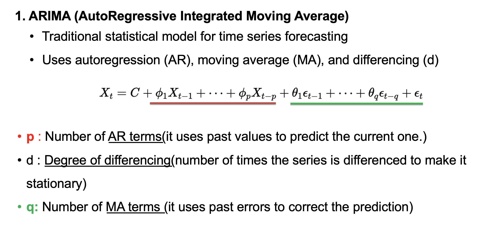
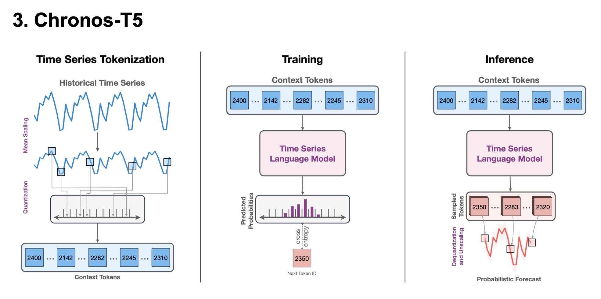
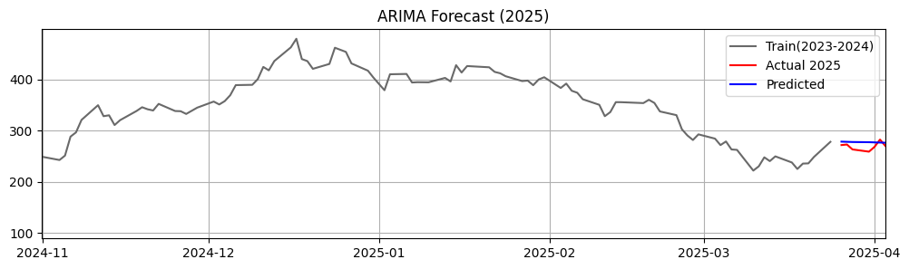

# Stock Prediction Using Transformer

https://www.linkedin.com/in/yejin-data/

## Overview

Stock price forecasting remains a challenging task due to the volatility of financial markets and the complex, nonlinear patterns in historical data. This study investigates whether cutting-edge AI models can outperform traditional statistical methods in predicting stock prices, with a focus on **closing price prediction**, a key market indicator.

Using real-world stock data collected from Yahoo Finance for major companies like **Tesla** and **Nvidia**, we compare three models:

- **ARIMA** (traditional statistical model)
- **TimesFM** (Google's Transformer-based model)
- **Chronos-T5** (Amazon's Transformer-based model)

## Evaluation Metrics

The models are evaluated using:
- Root Mean Squared Error (RMSE)
- Mean Absolute Error (MAE)
- Mean Squared Error (MSE)

## Key Findings


- Deep learning models, particularly Chronos-T5 and TimesFM, significantly outperform ARIMA in both short-term and long-term predictions.
- Chronos-T5 excels in long-term forecasting, effectively capturing trends and complex market behaviors over extended periods.
- TimesFM achieves the best short-term performance, handling immediate fluctuations and recent patterns more accurately.
- Traditional models like ARIMA struggle with nonlinear patterns and volatility, leading to higher errors.
- Transformer-based models demonstrate superior adaptability to the dynamic nature of stock prices.

---


1. **Project Structure**
   ```markdown
   ## Project Structure
   - `docs/`: Papers related to model architecture
   - `results/`: Plots and performance metrics

## 2. Model structure 







## 3. Result

### 🔷 ARIMA Model (90 days prediction) 


> **Performance**
> - MAE: 63.26  
> - MSE: 6864.38  
> - RMSE: 82.85  
> ❗Fails to capture nonlinear trends in stock prices

### 🔷 ARIMA Model (5 days prediction) 




> **Performance**
> - MAE: 9.64
> - MSE: 126.96
> - RMSE: 11.27

---

### 🔵 Google TimesFM (90 days prediction) 


> **Performance**
> - MAE: 39.17  
> - MSE: 2669.70  
> - RMSE: 51.96

### 🔵 Google TimesFM (5 days prediction) 


> **Performance**
> - MAE: 7.37
> - MSE: 80.86
> - RMSE: 8.99

---

### 🟢 Amazon Chronos-T5 (90 days prediction) 


> **Performance**  
> - MAE: 34.46  
> - MSE: 1784.40  
> - RMSE: 42.24

### 🟢 Amazon Chronos-T5 (5 days prediction) 


> **Performance**  
> - MAE: 18.20
> - MSE: 386.51
> - RMSE: 19.66


---

## Evaluation Metrix (90 days prediction) 

| Model     | MAE      | MSE       | RMSE     |
|-----------|----------|-----------|----------|
| **ARIMA** | 🔴 63.93 | 🔴 6925.83 | 🔴 83.22 |
| **TimesFM** | 39.17  | 2699.70  | 51.96   |
| **Chronos** | 🔵 34.45 | 🔵 1784.40 | 🔵 42.24 |


## Evaluation Metrix (5 days prediction) 


| Model     | MAE      | MSE       | RMSE     |
|-----------|----------|-----------|----------|
| **ARIMA** |  9.64 |  126.96 | 11.27 |
| **TimesFM** | 🔵 7.37   | 🔵 80.86  | 🔵 8.99    |
| **Chronos** | 🔴 18.20 | 🔴 386.51 | 🔴 19.66 |

📌 Summary:
> - For **long-term** predictions (90 days), Chronos-T5 shows the best overall performance, followed by TimesFM, while ARIMA performs the worst across all metrics.
> - For **short-term** predictions (5 days), TimesFM outperforms all models, achieving the lowest MAE, MSE, and RMSE. In contrast, Chronos-T5 struggles with short-horizon forecasting.


## 🔮 Future Work

1. **Expand Dataset**  
   - Incorporate more recent or diverse financial data to improve generalization.

2. **Apply More Advanced Statistical Models (SARIMA, Splines, etc.)**  
   - Explore seasonal and nonlinear structures using classical time series methods.

3. **Develop an Ensemble Model**  
   - *TimesFM* performs well for short-term forecasting, while *Chronos* excels in long-term prediction.  
   - Combine both models to improve stability and assign adaptive weights based on forecast horizon.

4. **Incorporate Sentiment Analysis (News & Social Media Trends)**  
   - Stock prices are heavily influenced by sentiment from news and social media.  
   - Adding external sentiment signals could improve forecast accuracy.


## 📄 License  
This project is licensed under the MIT License - see the [LICENSE](./LICENSE) file for details.

